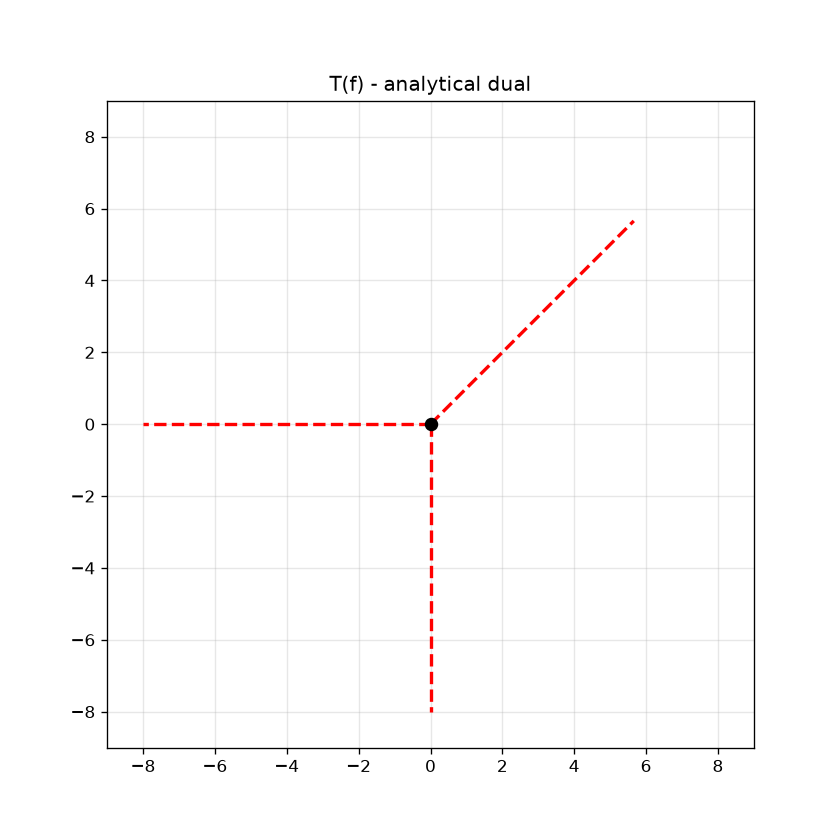
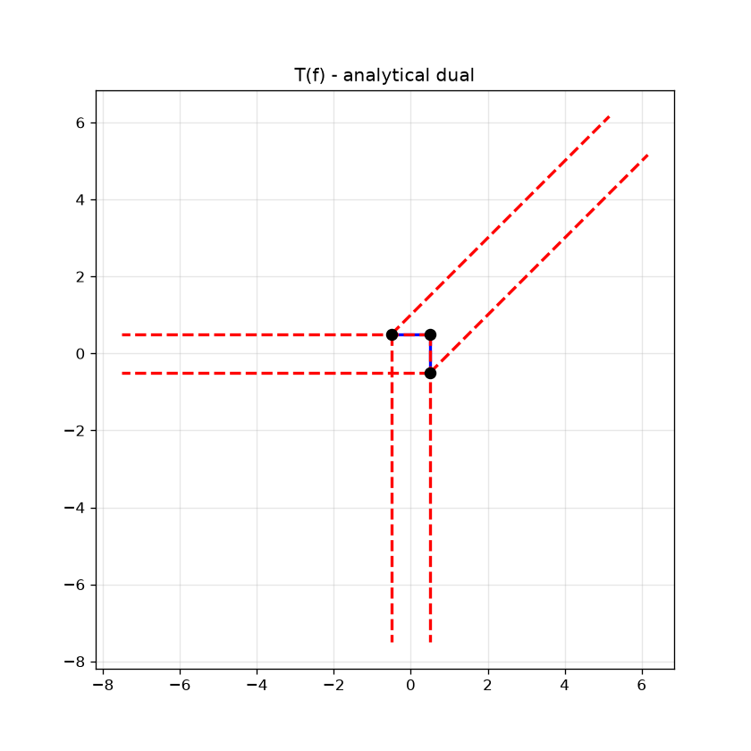
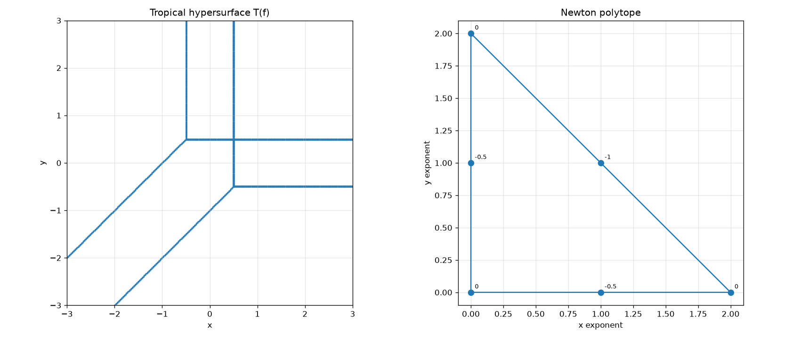

# tropix

tropix is a Python library for tropical geometry, implementing tropical
polynomial arithmetic, Newton polytopes, regular subdivisions, and
tropical hypersurfaces, motivated in part by their connection to ReLU
neural networks through tropical rational maps (Zhang et al., 2018).

## Status

Current version: v0.1.0

- [x] Tropical arithmetic
- [x] Tropical polynomials
- [x] Newton polytopes
- [x] Regular subdivisions
- [x] Analytical duals
- [x] Visualisation
- [ ] 3D support, ReLU network interface (planned for v0.2)

## Mathematical background

Tropical geometry replaces ordinary polynomial arithmetic with the
min-plus semiring (R ∪ {∞}, +, min), where addition becomes
"take the minimum" and multiplication becomes ordinary addition. A
tropical polynomial is a piecewise-linear function; the set of points
where its minimum is achieved by two or more monomials simultaneously
is its tropical hypersurface. This hypersurface is combinatorially
dual to a regular subdivision of the polynomial's Newton polytope,
obtained by lifting each exponent vector by its coefficient and taking
the lower convex hull of the resulting point cloud.

This library implements each stage of this pipeline:

```
arithmetic
    |
polynomials
    |
Newton polytope
    |
subdivision
    |
analytical dual
    |
visualisation
```

## Installation

```bash
pip install -e .
```

Requires Python 3.9+, NumPy, SciPy, and Matplotlib.

## Quick start

```python
from tropix import TropicalPolynomial, tropical_edges, plot_tropical_curve_dual

# the standard tropical line: min(x, y, 0)
f = TropicalPolynomial({(1, 0): 0.0, (0, 1): 0.0, (0, 0): 0.0}, nvars=2)

vertices, edges, boundary_edges, cells, index_map = tropical_edges(f)
print(f"{len(vertices)} vertex, {len(boundary_edges)} rays")
# 1 vertex, 3 rays

plot_tropical_curve_dual(f)
```

Running this example constructs and plots the analytical dual of the standard tropical line.

### The tropical line

The tropical line has one vertex at the origin and three unbounded
rays:



### A non-simplicial tropical conic

This tropical conic contains a non-simplicial (quadrilateral) cell in
its regular subdivision, producing three vertices, two bounded edges,
and six rays instead of the four-vertex combinatorics of a fully
triangulated smooth conic:

```python
f = TropicalPolynomial({
    (2, 0): 0.0, (0, 2): 0.0, (0, 0): 0.0,
    (1, 1): -1.0, (1, 0): -0.5, (0, 1): -0.5,
}, nvars=2)
```



This is the *analytical* dual, exact rather than grid-approximated. For
comparison, `visualisation.py`'s brute-force grid approximation of the
same curve's hypersurface, alongside its Newton polytope:



Together these figures illustrate the complete computational pipeline
implemented by tropix, from a tropical polynomial through its Newton
polytope and regular subdivision to the corresponding tropical
hypersurface and its analytical dual.

```
Polynomial
    |
    +----------> Grid approximation of T(f)  (independent, numerical)
    |
    v
Newton polytope
    |
    v
Regular subdivision
    |
    v
Analytical dual
```

## What's implemented (v0.1)

- **`arithmetic.py`**: `TropicalNumber`, the min-plus semiring.
  Validated domain, correct identity elements, consistent
  equality/hashing.
- **`polynomial.py`**: `TropicalPolynomial`, exponent-to-coefficient
  maps with full input validation and tropical arithmetic.
- **`newton.py`**: Newton polytope vertices and Minkowski sums,
  correctly handling the 1D case and degenerate inputs.
- **`subdivision.py`**: the regular subdivision induced by a
  polynomial's coefficients. Explicitly detects the degenerate
  (affine) case via an SVD-based rank test.
- **`dual.py`**: the analytical dual, tropical vertices, edges, and
  rays, computed from each cell's true geometric boundary.
- **`visualisation.py`**: brute-force grid approximation of a
  tropical hypersurface, and Newton polytope plotting.

All five mathematical modules have a corresponding test file; 49 tests
in total, covering the semiring axioms, evaluation correctness, the
1D Newton polytope fix, the flat-subdivision fix, and the exact
combinatorics of both the tropical line and a genuine tropical conic,
verified against known tropical geometry results.

```bash
pip install -e ".[dev]"
pytest
```

## Connection to neural networks

Zhang, Naitzat, and Lim (2018) show that a ReLU network computes a
tropical rational map: a ratio of tropical polynomials. Under this
correspondence, the network's linear regions (the pieces of input
space on which it reduces to a single affine map) correspond to cells
of a polyhedral complex dual to a Newton polytope subdivision, exactly
the structure this library computes directly.

A companion project, [nn-from-first-principles](https://github.com/amdrwn/nn-from-first-principles),
implements a feedforward network from scratch in NumPy and empirically
visualises its linear regions. Extracting the actual tropical
polynomial a trained network computes, connecting that project's
empirical picture to this library's exact machinery, is the natural
next step (planned for v0.2).

## Notes and limitations (v0.1)

- 2D only: hypersurface visualisation and the analytical dual
  construction currently require exactly 2 variables.
- The grid-based hypersurface plot (`visualisation.py`) is a brute-force
  approximation; the analytical dual (`dual.py`) is exact.
- No 3D support, no Gröbner bases, no tropical linear algebra yet;
  these are planned for later versions.

## Current roadmap

**v0.1** (current): 2D core, arithmetic, polynomials, Newton polytopes,
regular subdivisions, the analytical dual, and grid-based visualisation.

**v0.2**: 3D hypersurfaces, a ReLU network interface for extracting
the tropical rational map represented by a trained network, and
explicit balancing-condition verification.

Further plans (Gröbner bases, tropical linear algebra, and beyond) are
tracked in the repository's issues rather than here.

## References

Zhang, L., Naitzat, G., & Lim, L.-H. (2018).  
Tropical Geometry of Deep Neural Networks.  
Proceedings of the 35th International Conference on Machine Learning (ICML).
